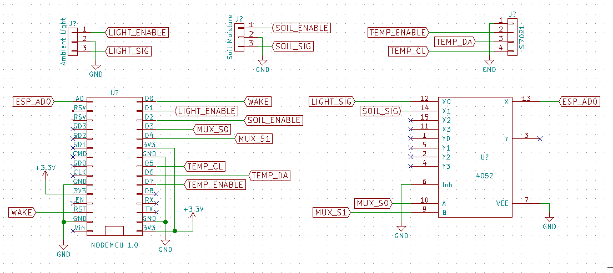

# growdammit
Garden thing, logs temperature, humidity, soil moisture, and ambient light.

Prototype:

Prototype graph from logging overnight:

## Design
### Circuit

#### Analog Multiplexer
* E (6) connected to GND
* GND (8) connected to GND
* S1 (9) connected to GND
* S0 (10) connected to ESP D3 (GPIO0)
* A0 (12) connected to ambient light SIG
* AN (13) connected to ESP AD0
* A1 (14) connected to soil moisture SIG
* VCC (16) connected to 3.3v

#### Soil Moisture Sensor
* SIG pin connected to mux 14 (A1)
* GND pin connected to GND
* VCC pin connected to D2 (GPIO4)

#### Ambient Light Sensor
* SIG pin connected to mux 12 (A0)
* GND pin connected to GND
* VCC pin connected to D1 (GPIO5)

#### Temperature and Humidity Sensor
* GND pin connected to GND
* 3.3V pin connected to 3.3V
* DA pin connected to D6 (GPIO12)
* CL pin connected to D5 (GPIO14)

## Parts list
* ESP8266 12E Dev Board
* Soil Moisture Sensor
* Temperature and Humidity Sensor
* Ambient Light Sensor
* Analog Multiplexer
* Solar Buddy
* Solar Panel
* Lipo
* Transistors

# Datasheets

## ESP8266 Dev Board
* Development Docs: https://arduino-esp8266.readthedocs.io/en/latest/index.html
* Product link: https://www.banggood.com/Geekcreit-Doit-NodeMcu-Lua-ESP8266-ESP-12E-WIFI-Development-Board-p-985891.html
* Getting started with Arduino IDE guide: http://www.instructables.com/id/Programming-the-ESP8266-12E-using-Arduino-software/
* USB Driver: http://www.chinstruments.com/downloads.shtml
* Pinout: http://www.kloppenborg.net/images/blog/esp8266/esp8266-node-mcu-pinout.png

## Soil Moisture Sensor
* Product link: https://www.sparkfun.com/products/13322
* Schematic: https://cdn.sparkfun.com/datasheets/Sensors/Biometric/SparkFun_Soil_Moisture_Sensor.pdf
* Hookup guide: https://learn.sparkfun.com/tutorials/soil-moisture-sensor-hookup-guide

## Temperature and Humidity Sensor
* Product link: https://www.sparkfun.com/products/13763
* Schematic: https://cdn.sparkfun.com/datasheets/Sensors/Weather/SparkFun_Si7021_Breakout.pdf
* Datasheet: https://cdn.sparkfun.com/datasheets/Sensors/Weather/Si7021.pdf
* Hookup guide: https://learn.sparkfun.com/tutorials/si7021-humidity-and-temperature-sensor-hookup-guide
* Libraries: https://github.com/sparkfun/Si7021_Breakout/tree/master/Libraries

## Ambient Light Sensor
* Product link: https://www.sparkfun.com/products/8688
* Datasheet: https://www.sparkfun.com/datasheets/Sensors/Imaging/TEMT6000.pdf
* Hookup guide: https://learn.sparkfun.com/tutorials/temt6000-ambient-light-sensor-hookup-guide

## Analog Multiplexer
* CD74HC4052E
* Product ink: https://www.digikey.ca/product-detail/en/texas-instruments/CD74HC4052E/296-9217-5-ND/376770
* Datasheet: https://www.ti.com/lit/ds/symlink/cd74hc4051.pdf

## Solar Buddy
* Product link: https://www.sparkfun.com/products/12885
* Schematic: https://cdn.sparkfun.com/datasheets/Prototyping/SunnyBuddy-v13a.pdf
* Datasheet: https://cdn.sparkfun.com/datasheets/Prototyping/LT3652.pdf
* Hookup guide: https://learn.sparkfun.com/tutorials/sunny-buddy-solar-charger-v13-hookup-guide-

## 2W Solar Panel
* Product link: https://www.sparkfun.com/products/13781

## Lipo

## Transistors
* Datasheet: https://cdn.sparkfun.com/datasheets/Components/General/BC337.pdf
